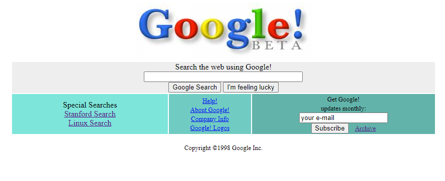

Bu repo İçerisinde bir adet README dosyası, bir adet index.html ve css dosyası barındırıyor.

## Installation
Öncelikle projeyi clonelayın.
```
git clone https://github.com/erkulsenanur/google1998.git 
```

## Usage
Projeyi klonladıktan sonra Visual Studio Code programında açınız.

Linux için:
```
cd google1998
code .
```

## Contributing
Pull requestler kabul edilir. Büyük değişiklikler için, lütfen neyi değiştirmek istediğinizi tartışmak için bir konu açınız.

## License
[MIT](https://choosealicense.com/licenses/mit/)
